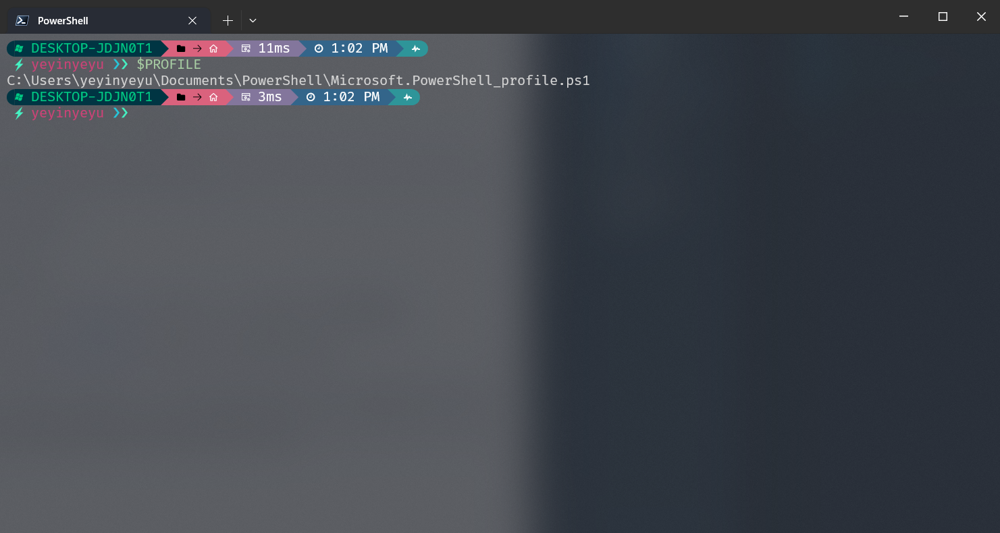
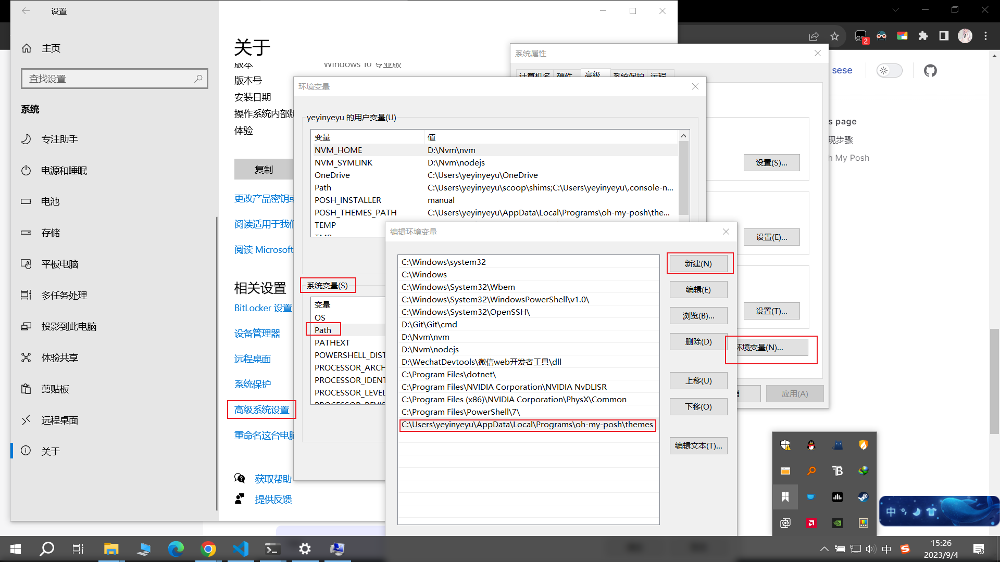
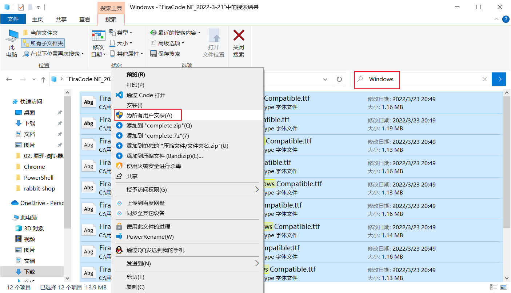
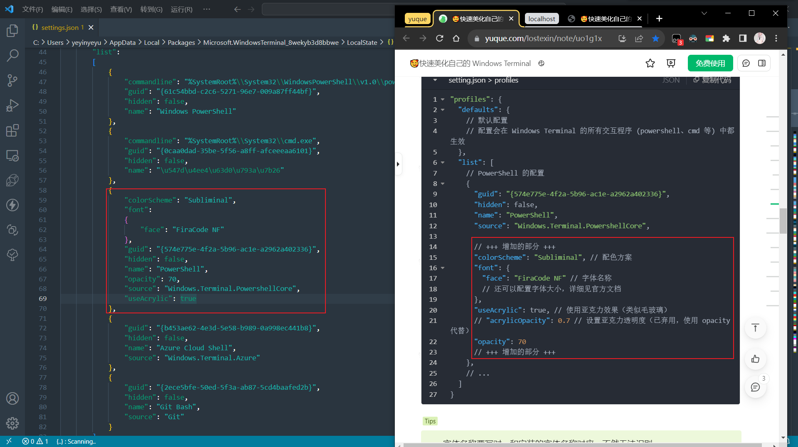
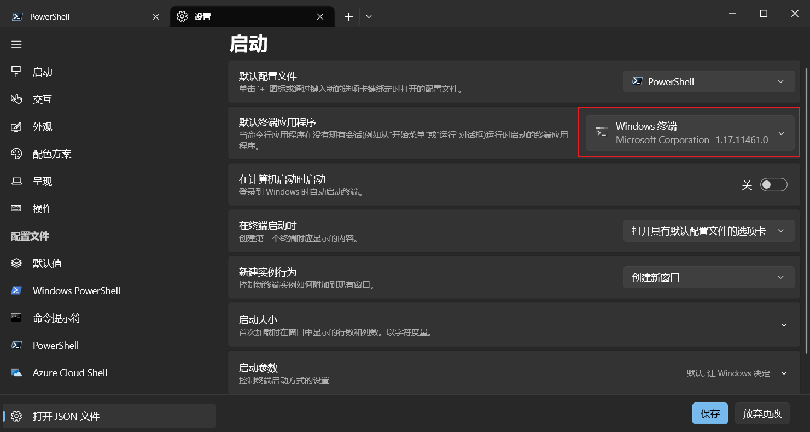
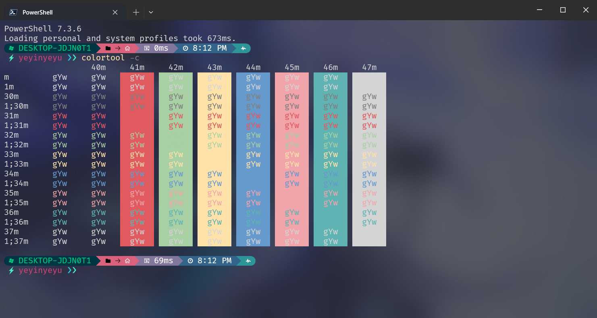

# 🥰快速美化自己的 Windows Terminal

## 快速实现步骤

### 安装PowerShell7
要安装Oh My Posh 需要先安装PowerShell7(推荐下载x64的stable版本v7.3.6的msi)
<p>
  下载地址
  <a href="https://github.com/PowerShell/PowerShell">PowerShell7</a>
</p>

### 安装 Windows Terminal
<div>
 <ul>
    <li>单用户在微软商店搜索下载Windows Terminal即可(省事)</li>
    <li>多用户需要在github上下载<a href="https://github.com/microsoft/terminal">Windows Terminal</a>为所有用户下载</li>
  </ul>
</div>

打开 Windows Terminal 的 PowerShell 输入:
```
Install-Module oh-my-posh -Scope CurrentUser
```
如需要yes确认输入y即可
### 安装 Oh My Posh
可选: 在 powershell 中输入``$PROFILE``可获得powershell 配置文件脚本的安装路径


1. 在 powershell 中输入``code $PROFILE``打开 powershell 的配置文件脚本，向该文件中写入如下内容: (如果没有vscode的话就运行``notepad $PROFILE``)
```
oh-my-posh init pwsh | Invoke-Expression
```
::: tip
保存退出
:::

2. 然后在命令行中，输入如下命令，使刚刚编辑的配置脚本生效：
```
. $PROFILE
```

3. 在powershell 中输入：
```
 Get-PoshThemes
```
::: details
可以看到很多主题列表, 可以选一个自己喜欢的主题将名字复制下来
:::
::: danger
如果遇到报错, 无法将“oh-my-posh”项识别为 cmdlet、函数、脚本文件或可运行程序的名称,可运行下面的代码，可能需要运行两次
:::
```
Set-ExecutionPolicy Bypass -Scope Process -Force; Invoke-Expression ((New-Object System.Net.WebClient).DownloadString('https://ohmyposh.dev/install.ps1'))
```

4. 在 powershell 中再次输入``code $PROFILE``打开 powershell 的配置文件脚本,将之前写入的内容注释或者删除

```
 oh-my-posh init pwsh --config 'C:\Users\yeyinyeyu\AppData\Local\Programs\oh-my-posh\themes\montys.omp.json' | Invoke-Expression
```
::: tip
参考我的配置将yeyinyeyu换成自己的用户名, 并将montys换成刚刚复制的主题名字
:::

5. 再次再powershel 中运行``.$PROFILE``即可使新主题生效

6. 添加系统环境变量

生效后可以在除 powershell 外的其它程序比如 cmd、bash 上使用 oh-my-posh, 将路径
<p>C:\Users\yeyinyeyu\AppData\Local\Programs\oh-my-posh\themes</p>
添加到系统高级设置的系统环境变量的Path里面，注意替换用户名yeyinyeyu为自己的用户名
 

## 配置 Oh My Posh
### 安装 Nerd Fonts 字体解决乱码 
下载并安装 Nerd Fonts 的字体。Nerd Fonts 为开发者常用的字体增添了巨量图标(icon)，官网称其为修补(patch)，我使用的是 <a href="https://github.com/ryanoasis/nerd-fonts/tree/master/patched-fonts/FiraCode">Fira Code</a>（连字字体） Oh My Posh 官方推荐的是 Meslo👻。下载下来后把 Windows Compatible（兼容 Windows）的字体都安装了
<p>
  字体<a href="https://lecloud.lenovo.com/share/2s4L8egPomwLqWdR1">网盘链接</a>，别人那里拿的🥰
</p>
<p>
  字体<a href="./public/fonts/FiraCode NF_2022-3-23.zip">本地链接</a>，自己下的🥰
  , 二选一下载即可
</p>

::: tip
下载解压之后在里面搜索Windows，然后ctrl+A全选后右键选择为所有用户安装即可
:::

 

### 配置 Windows Terminal
配置 WT 的配置文件（setting.json），在 WT 设置中就可以打开 JSON 文件，找到 profiles 和 schemes，

<br />
<br />  

#### 配置 setting.json > profiles
<br/>


增加以下代码(找到对应的位置增加增加的部分的代码，右侧为参考增加，左侧为添加后自动格式化后代码)

```
"profiles": {
  "defaults": {
    // 默认配置
    // 配置会在 Windows Terminal 的所有交互程序 (powershell、cmd 等) 中都生效
  },
  "list": [
    // PowerShell 的配置
    {
      "guid": "{574e775e-4f2a-5b96-ac1e-a2962a402336}",
      "hidden": false,
      "name": "PowerShell",
      "source": "Windows.Terminal.PowershellCore",
      
      // +++ 增加的部分 +++
      "colorScheme": "Subliminal", // 配色方案
      "font": {
        "face": "FiraCode NF" // 字体名称
        // 还可以配置字体大小，详细见官方文档
      },
      "useAcrylic": true, // 使用亚克力效果（类似毛玻璃）
      // "acrylicOpacity": 0.7 // 设置亚克力透明度（已弃用，使用 opacity 代替）
      "opacity": 70
      // +++ 增加的部分 +++
    },
    // ...
  ]
}
```

#### 配色方案 setting.json > schemes
<br/>


增加以下代码(直接在shemes键值对里的数组包对象里的最前面增加一个具名为Subliminal的配色对象即可，右侧为参考增加，左侧为添加后自动格式化后代码)

```
"schemes": [
  {
    "name": "Subliminal",
    "black": "#7f7f7f",
    "red": "#e15a60",
    "green": "#a9cfa4",
    "yellow": "#ffe2a9",
    "blue": "#6699cc",
    "purple": "#f1a5ab",
    "cyan": "#5fb3b3",
    "white": "#d4d4d4",
    "brightBlack": "#7f7f7f",
    "brightRed": "#e15a60",
    "brightGreen": "#a9cfa4",
    "brightYellow": "#ffe2a9",
    "brightBlue": "#6699cc",
    "brightPurple": "#f1a5ab",
    "brightCyan": "#5fb3b3",
    "brightWhite": "#d4d4d4",
    "background": "#282c35",
    "foreground": "#d4d4d4",
    "cursorColor": "#c7c7c7",
    "selectionBackground": "#484e5b"
  },
  // ...
]
```

重新打开终端，发现它已经变成你想要的 ~~形状~~ 主题和配色了🥰，字体也没有乱码, 还有历史记录代码提示🥰

#### 配置终端默认
将默认终端应用程序由让 ``Windows决定`` 改为 ``Windows 终端``


### 编辑器中的终端字体乱码
以VSCode为例, 设置终端字体为 Nerd Fonts 字体（我这里是 FiraCode NF）
在VSCode设置里面搜索``Terminal>Integrated:Font Family``将值改为你安装的字体即可(这里是``FiraCode NF``)


## 成果展示
### VSCode 终端
<p></p>

### PowerShell 终端
::: tip
可使用 scoop 安装PowerShell的配色管理软件: colortool
:::

```
scoop install colortool
```
``查看colortool是否安装成功``
```
colortool -s
```
``colortool 展示``
```
colortool -c
```

<p></p>
